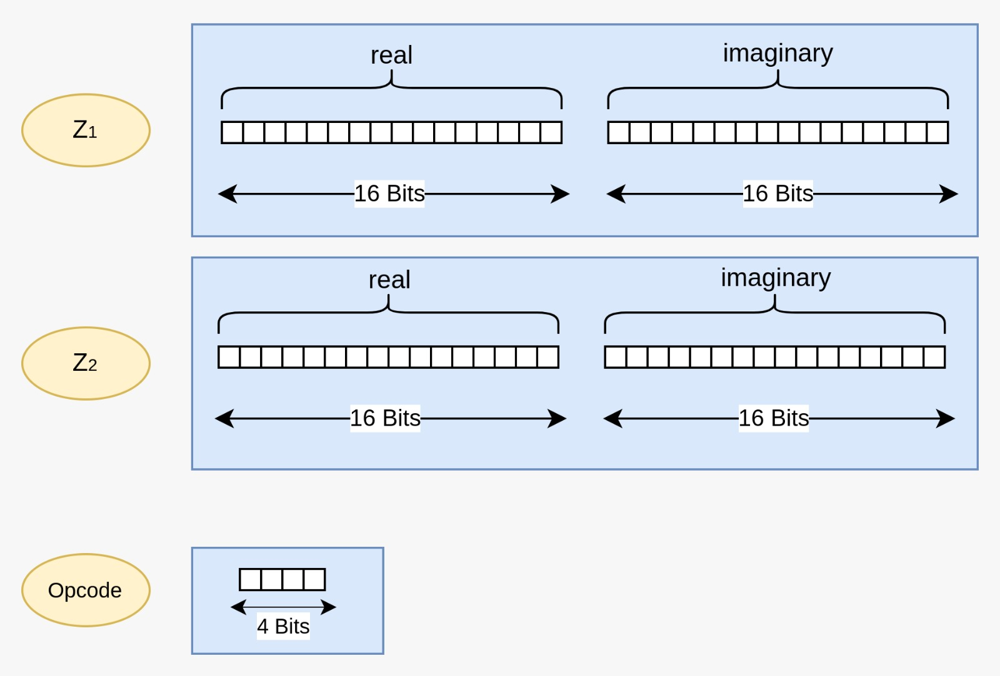
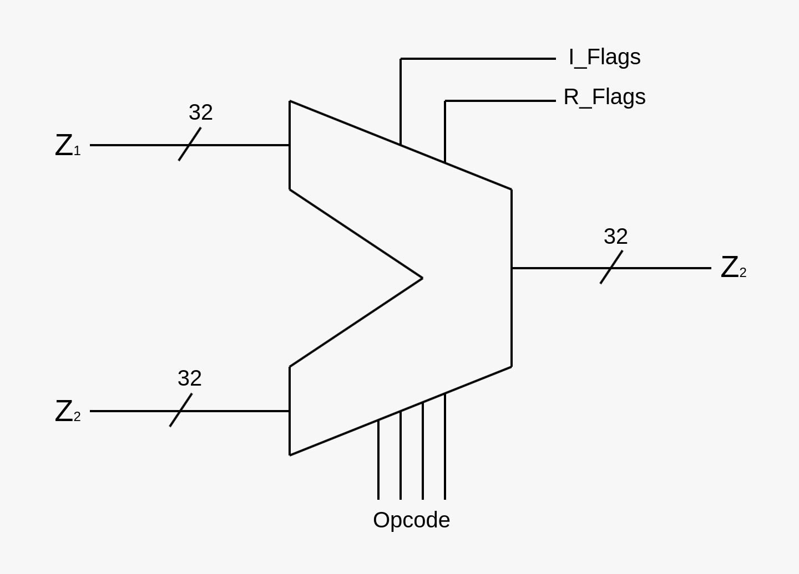
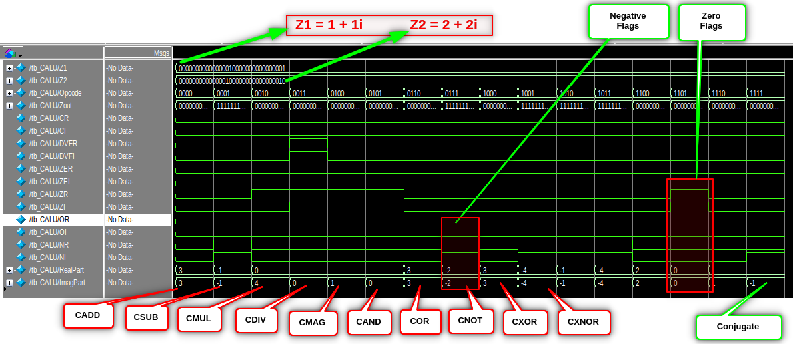

# Complex Arithmetic Logic Unit
This repository contains the hardware design for an Arithmetic Logic Unit (ALU) specifically tailored to perform operations on complex numbers. Complex numbers are represented in the form **Z = a + bi**, where **a** denotes the real part, **b** denotes the imaginary part, and **i** is the imaginary unit, defined as the square root of -1 (**sqrt(-1)**). The ALU design in this project enables efficient arithmetic operations on complex numbers, including addition, subtraction, and multiplication, by treating the real and imaginary components separately within the hardware. This approach allows for the precise handling of both components simultaneously, ensuring accurate results for complex arithmetic tasks. The design is well-suited for applications requiring complex number manipulation, such as digital signal processing (DSP), communication systems, and scientific computing, where operations on complex numbers are essential. The implementation is optimized for FPGA and ASIC synthesis, providing a flexible and scalable solution for high-performance computational environments. By leveraging this hardware ALU, complex arithmetic operations can be executed faster and more efficiently than with traditional software-based methods.
### Instruction Format
Instruction format is described in the following figure. Where `Z1` and `Z2` are two 32 bit complex numbers. Most significant 2 bytes represents the real part and 2 least significant bytes are imaginary part of the complex number. This is done because most of the ISAs are 32 bit so the CALU becomes compatable with them. Opcode multiplexs between instruction e.g. if user wants to add two complex number the opcode will be `0000` and for subtraction `0001`  

### CALU Inputs & Outputs
A Complex Arithmetic Logic Unit (CALU) processes two 32-bit numbers, which are divided into their real and imaginary components for complex arithmetic operations. Based on the results of the ALU, flags are set accordingly. R_Flags and I_Flags are the flags corresponding to the real and imaginary part of the CALU output.

### Instructions

### Flags

| **R Flags** | **I Flags** | **Description**               |
|-------------|-------------|-------------------------------|
| CR          | CI          | Carry                          |
| DVFR        | DVFI        | Division overflow error        |
| ZER         | ZEI         | Zero error                     |
| ZR          | ZI          | Zero output                    |
| OR          | OI          | Overflow                       |
| NR          | NI          | Negative                       |

### Results

